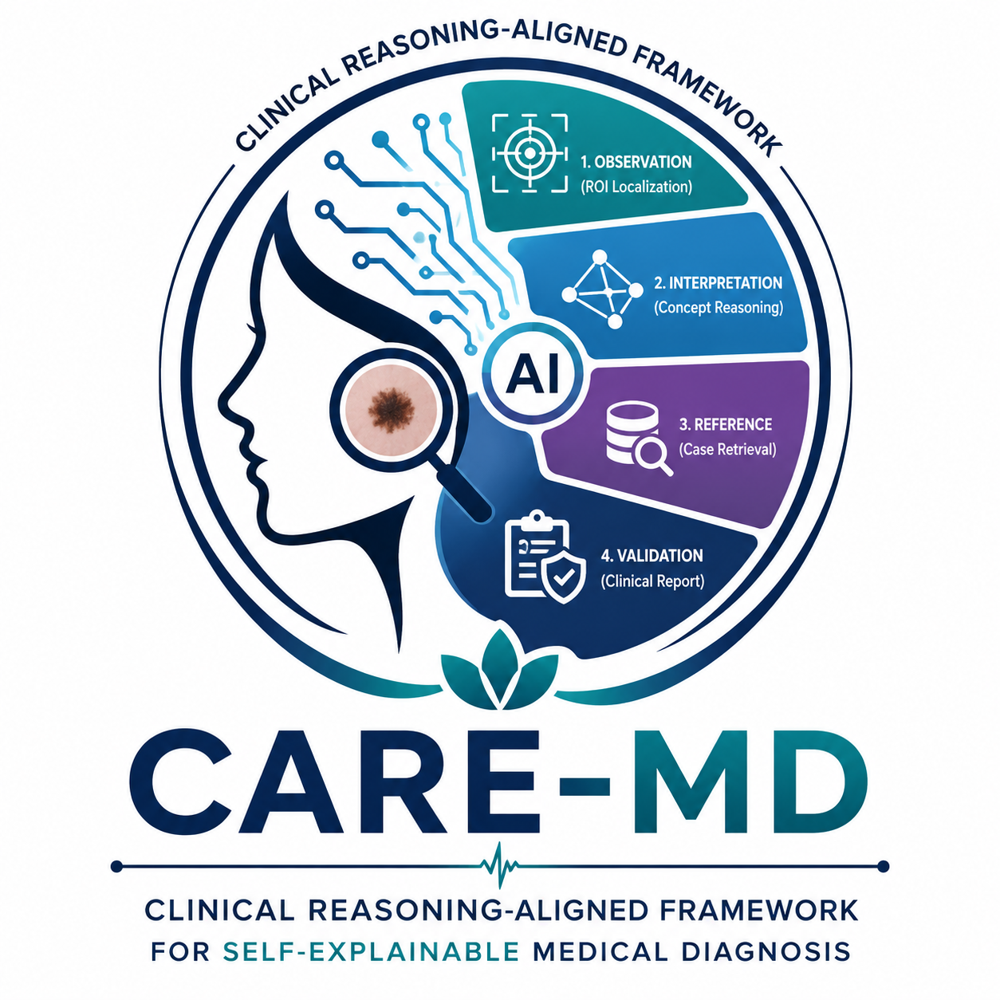
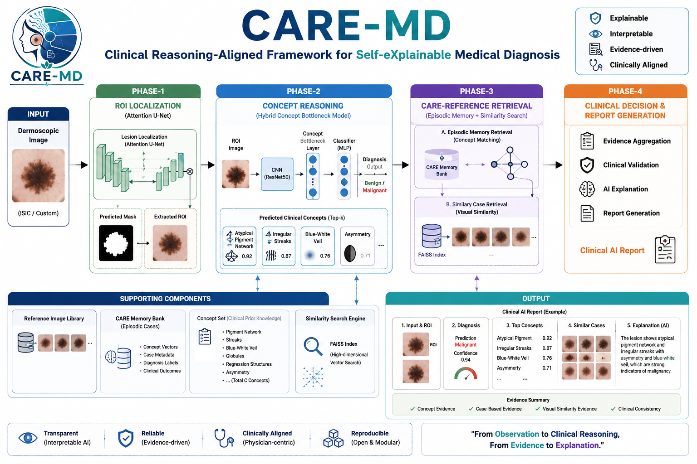

  

<h1 align="center">CARE-MD</h1>

Clinical Reasoning-Aligned Framework for Self-Explainable Medical Diagnosis

---

# Framework Architecture

---

# Overview

CARE-MD (Clinical Reasoning-Aligned Framework for Self-Explainable Medical Diagnosis) is an explainable AI framework for dermoscopic skin lesion diagnosis. The framework integrates lesion localization, concept reasoning, episodic memory retrieval, and evidence-based validation to produce transparent and clinically interpretable diagnostic reports.

---

# Key Features

* Automatic ROI Localization using Attention U-Net
* Clinical Concept Reasoning using Hybrid Concept Bottleneck Model
* CARE-Reference Episodic Memory Retrieval
* Top-K Similar Clinical Case Retrieval
* Evidence-based Clinical Decision Support
* Automated Clinical Report Generation
* Explainable AI for Medical Diagnosis

---

# Pipeline

Input Image

↓

Phase-1 : ROI Localization

↓

Phase-2 : Concept Reasoning

↓

Phase-3 : CARE-Reference Retrieval

↓

Phase-4 : Clinical Decision Report
